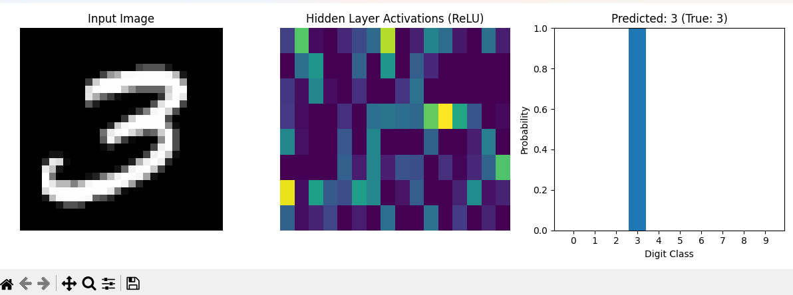

# NeuralScope: Neural Network From Scratch (MNIST Classifier)



## Overview
NeuralScope is a Python project that implements a feedforward neural network from scratch (using only NumPy) to classify handwritten digits from the MNIST dataset. The project is designed for learning and experimentation, with clear code and visualizations.

## Features
- Fully connected neural network (1 hidden layer, customizable)
- Trains on MNIST dataset (0–9 digits)
- Implements forward pass, backpropagation, and gradient descent from scratch
- Visualizes hidden layer activations and output probabilities
- Interactive visualizer for exploring predictions
- No high-level ML frameworks (no TensorFlow/PyTorch for the network itself)

## Requirements
- Python 3.8+
- numpy
- matplotlib
- tensorflow (for downloading MNIST data only)

Install requirements with:
```bash
pip install numpy matplotlib tensorflow
```

## Project Structure
```
NeuralScope/
├── data_loader.py      # Loads and preprocesses MNIST data
├── network.py          # Neural network implementation and training
├── visualizer.py       # Visualizes activations and predictions
├── tasks.md            # Project task breakdown
├── .gitignore          # Git ignore rules
└── README.md           # This file
```

## Usage

### 1. Train the Neural Network
```bash
python NeuralScope/network.py
```
- Trains the network on MNIST for 300 epochs (default)
- Saves trained weights to `trained_weights.npz`

### 2. Visualize Predictions and Activations
```bash
python NeuralScope/visualizer.py
```
- Loads the trained network
- Shows a random test digit, hidden activations, and output probabilities
- Press **Enter** for a new digit, or **q** to quit

## Customization
- Change network size, epochs, batch size, or learning rate in `network.py`
- Add more layers or features as you wish

## Credits
- MNIST dataset: Yann LeCun et al.
- Project inspired by classic "neural network from scratch" tutorials
- Created by [Your Name or GitHub Username]

---

Feel free to fork, modify, and experiment! If you find this useful, star the repo or open an issue with suggestions. 